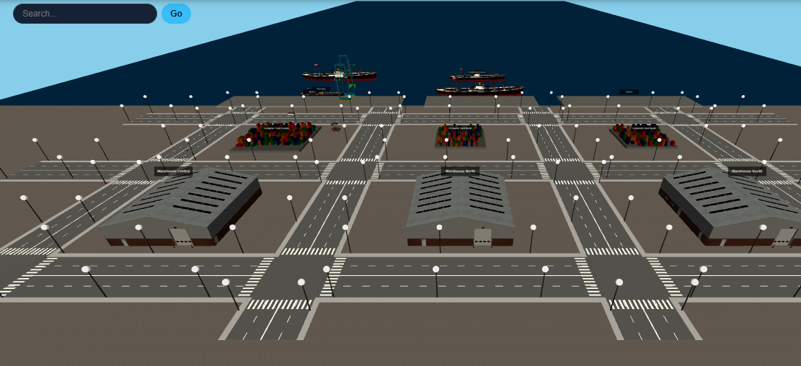

<div align="center">

# Port Management System

**A web platform to manage the operations of a container port, inspired by the Port of Sines.**

[](https://github.com/igor-coutinho22/Port_Management_System/actions/workflows/ci.yml)


[**Live demo**](https://igor-coutinho22.github.io/Port_Management_System/) · [**Documentation**](docs/) · [**Português**](README.pt.md)



</div>

> [!NOTE]
> **Academic team project.** Developed by a team of five students for LAPR5, the integrative project of
> the 3rd year of the BSc in Informatics Engineering at ISEP (2025/26). This is a portfolio copy with
> the team's full commit history.

---

## Contents

- [About](#about)
- [Live demo](#live-demo)
- [Features](#features)
- [Architecture](#architecture)
- [Tech stack](#tech-stack)
- [Getting started](#getting-started)
- [Testing](#testing)
- [Team](#team)
- [Credits and license](#credits-and-license)

---

## About

The system supports the daily work of a container port: registering vessels, docks and storage
areas, planning vessel visits, scheduling dock operations, handling incidents and visualising the
whole port in 3D. Each type of user (administrator, port officer, logistics operator and shipping
representative) has access to the areas of their role.

---

## Live demo

**Live demo:** [igor-coutinho22.github.io/Port_Management_System](https://igor-coutinho22.github.io/Port_Management_System/)

The repository contains the **complete system**, but the public link runs a **demo build**: the real
frontend with a **simulated backend** that runs in the browser, so anyone can try the app without
servers, databases or accounts.

| | Full system (this repository) | Live demo (GitHub Pages) |
|---|---|---|
| **Frontend** | React SPA with 3D view | the same code |
| **Backend** | ASP.NET Core + Node.js APIs | simulated in the browser |
| **Data** | PostgreSQL + MongoDB | sample data generated from the real APIs |
| **Sign-in** | Microsoft Entra ID, role-based access | automatic demo user with every role |
| **Scheduling** | Prolog algorithms | simplified plan computed in the browser |
| **Saving changes** | stored in the databases | accepted, but not saved |

<details>
<summary><b>How the demo mode works</b></summary>
<br>

- It is published to GitHub Pages by a [workflow](.github/workflows/pages.yml) and enabled automatically there, or locally by adding `?demo` to the frontend URL
  (e.g. `https://localhost:5179/?demo`).
- It lives only in [`src/Frontend/wwwroot/demo/`](src/Frontend/wwwroot/demo/):
  [`demo-mode.js`](src/Frontend/wwwroot/demo/demo-mode.js) answers the API calls and
  [`demo-data.js`](src/Frontend/wwwroot/demo/demo-data.js) holds the sample data.
- It does not change how the full system works.

</details>

---

## Features

| Area | What it does |
|---|---|
| **Master data** | Vessels, vessel types, docks, storage areas (warehouses and container yards), resources, staff and qualifications, shipping organizations and representatives |
| **Vessel visits** | Visit notifications with crew and cargo manifests (ISO 6346 container validation), approved or rejected by port officers |
| **Operations** | Vessel visit executions, daily operation plans and complementary tasks |
| **Dock scheduling** | Prolog algorithms that order the day's vessels to minimise departure delays (exact search, genetic algorithm and heuristics), multi-crane comparison and dock rebalancing |
| **Incidents** | Reporting, tracking and resolution of operational incidents |
| **3D port view** | Docks, vessels, cranes and yards built from live data, day/night cycle, object search, information panels, selection spotlight and minimap |
| **Security** | Sign-in with Microsoft Entra External ID, role-based access and user administration via Microsoft Graph |
| **Privacy (GDPR)** | Versioned privacy policy, user acceptance and personal data export |
| **Languages** | English and Portuguese |

---

## Architecture

```
                    ┌──────────────────────────────┐
                    │ Frontend (SPA)  :5179        │
                    │ React 18 · Three.js · MSAL   │
                    └──────┬────────────────┬──────┘
                           │ REST + JWT     │ REST + JWT
          ┌────────────────▼─────┐   ┌──────▼──────────────────┐
          │ WebApp  :5001        │◄──┤ OEM service  :6001      │
          │ ASP.NET Core 8       │   │ Node.js · Express       │
          │ EF Core · PostgreSQL │   │ MongoDB · SWI-Prolog    │
          │ (master data)        │   │ (operations, scheduling)│
          └──────────┬───────────┘   └──────────┬──────────────┘
                     └──────────┬───────────────┘
                   Microsoft Entra External ID + Microsoft Graph (roles)
```

- **WebApp**: master data API (vessels, docks, storage areas, staff, visit notifications).
- **OEM service**: operations API (executions, plans, incidents, tasks, privacy) and the Prolog scheduler.
- Both follow a **layered, DDD-inspired design**: domain, application and infrastructure layers, with
  aggregates, value objects, DTOs, mappers and repositories.
- Architecture documentation (C4 model, domain model, sequence diagrams, glossary) is in [`docs/`](docs/).

---

## Tech stack

| Layer | Technologies |
|---|---|
| **Master data API** | C#, ASP.NET Core 8, Entity Framework Core, PostgreSQL, Swagger |
| **Operations API** | Node.js, Express 5, Mongoose, MongoDB, SWI-Prolog |
| **Frontend** | React 18, Three.js, MSAL.js, CSS |
| **Identity** | Microsoft Entra External ID (CIAM), Microsoft Graph |
| **Testing** | xUnit, Moq, FluentAssertions, Jest, Supertest, mongodb-memory-server, Cypress |
| **CI** | GitHub Actions |

<details>
<summary><b>Project structure</b></summary>
<br>

```
├── src/
│   ├── WebApp/        # ASP.NET Core API (master data)
│   ├── Oem_Node/      # Node.js API (operations, scheduling, incidents, privacy)
│   └── Frontend/      # SPA, 3D visualization and Cypress E2E tests
├── tests/WebApp/      # Unit, integration and system tests for the WebApp
└── docs/              # C4 diagrams, domain model, user stories, reports
```

</details>

---

## Getting started

### Prerequisites

- .NET 8 SDK
- Node.js 22 or later
- PostgreSQL and MongoDB
- [SWI-Prolog](https://www.swi-prolog.org/), with `swipl` on the `PATH` (for dock scheduling)

### 1. Master data API (WebApp)

```bash
cd src/WebApp
dotnet user-secrets set "AzureAdCiam:BackendApp:ClientSecret" "<secret>"
dotnet run
```

Runs on `https://localhost:5001` (Swagger at `/swagger`). The database is migrated and filled with
sample data on startup. The connection string is in `appsettings.json`.

### 2. Operations API (OEM service)

```bash
cd src/Oem_Node
cp .env.example .env    # then fill in the values
npm ci
npm run dev
```

Runs on `http://localhost:6001`.

### 3. Frontend

```bash
cd src/Frontend
npm ci
npm run certs           # creates a local TLS certificate for localhost
npm start
```

Open `https://localhost:5179`. The backend addresses are set in
[`src/Frontend/wwwroot/js/config.js`](src/Frontend/wwwroot/js/config.js).

> [!TIP]
> After installing the dependencies, `npm run dev` in the repository root starts the three services at once.

<details>
<summary><b>Sign-in and using your own Microsoft Entra tenant</b></summary>
<br>

Signing in requires the project's Entra External ID tenant and a user with an assigned role.
To use your own tenant, update:

- `src/Frontend/wwwroot/auth/msalConfig.js`
- the `AzureAdCiam` section of `src/WebApp/appsettings.json`
- the Azure variables in `src/Oem_Node/.env`

</details>

---

## Testing

| Suite | Command | Tests |
|---|---|---|
| **WebApp** (unit, integration, system) | `dotnet test` | 315 |
| **OEM service** (unit, integration, functional, system, Prolog) | `cd src/Oem_Node && npm test` | 75 |
| **End-to-end** (Cypress, services running) | `cd src/Frontend && npx cypress run` | 28 |

The WebApp and OEM test suites run automatically in GitHub Actions on every push.

---

## Team

| Name | Student number |
|---|---|
| Rafael Barbosa | 1230544 |
| Igor Coutinho | 1230543 |
| João Soares | 1211064 |
| Miguel Pais | 1230851 |
| Sofia Costa | 1231006 |

**Instituto Superior de Engenharia do Porto (ISEP)** · Informatics Engineering · LAPR5 · 2025/26 · Group 3DD-02

---

## Credits and license

- Third-party 3D models are credited in [`CREDITS.md`](src/Frontend/wwwroot/models/CREDITS.md).
- This repository is shared for portfolio and educational purposes. No license is granted for reuse
  of the source code.
